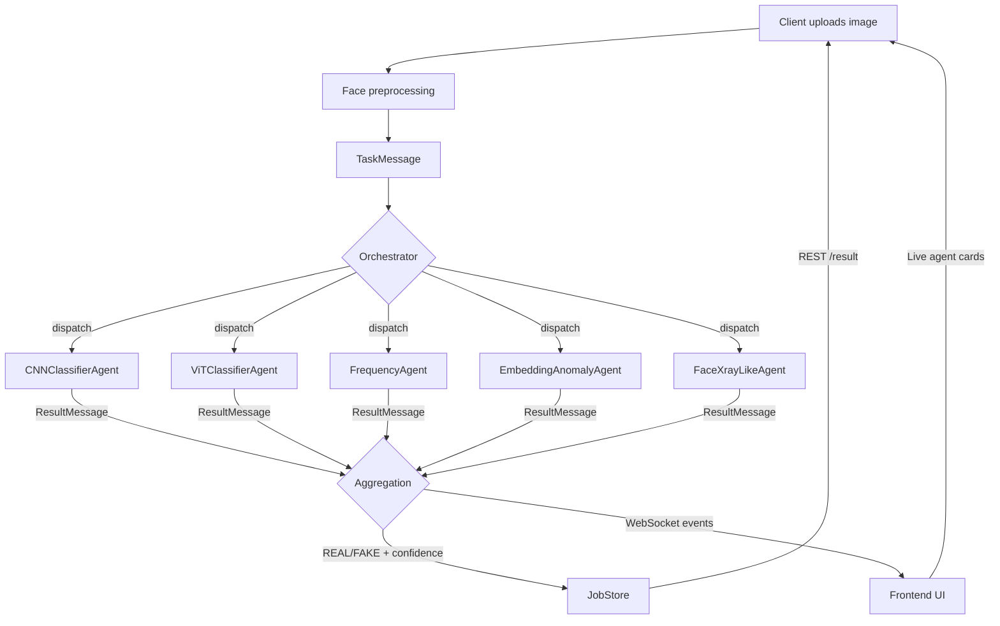

# Stage 2 Figures and Tables Plan

## Proposed Figures

### Figure 1 — System Architecture (Mermaid)



### Figure 2 — Data-Flow Sequence for a Single Analysis Job (textual or Mermaid)

- Client → REST `/api/analyze`
- REST → `FacePreprocessor.process()`
- REST → `Orchestrator.start_job()` → emits `job_started`
- Orchestrator → 5 × `asyncio.create_task(_dispatch_to_agent)`
- Each agent → `process()` → `ResultMessage` or `ErrorMessage`
- `on_agent_result` → Checkpoint → `agent_completed` → check quorum
- `_monitor_timeouts` → Remind (retry if needed)
- quorum reached → `aggregate_results` → `job_completed`
- Client receives verdict via WebSocket + REST

### Figure 3 — Git Timeline

Because only one commit exists, this should be a minimal diagram or a table. Example:

```
| Date | Commit | Description |
|------|--------|-------------|
| 2026-01-15 | f08acd9 | Initial commit: Mandrake Deepfake Detector |
```

### Figure 4 — Detector Signal Families

Table mapping each agent to its input modality and signal family.

## Proposed Tables

### Table 1 — Detector Comparison

| Agent | Model family | Input size | Signal family | Head initialization | Current weight |
|--------|--------------|------------|---------------|---------------------|----------------|
| CNNClassifierAgent | EfficientNet-B0 | 224×224 | Deep representation | Random | 1.0 |
| ViTClassifierAgent | ViT-B/16 | 224×224 | Attention patterns | Random | 1.0 |
| FrequencyAgent | FrequencyMLP (FFT) | 256-d vector | Spectral / GAN artifacts | Random | 0.8 |
| EmbeddingAnomalyAgent | EmbeddingEncoder | 112×112 | Embedding anomaly | Random | 0.9 |
| FaceXrayLikeAgent | BoundaryDetector | 128×128 | Blending boundaries | Random | 0.85 |

### Table 2 — Mandrake Pattern Implementation Status

| Pattern | Description | Implementation location | Status |
|---------|-------------|------------------------|--------|
| Remind | Timeout + retry | `app/core/orchestrator.py` `_monitor_timeouts`, `on_agent_error` | Implemented |
| Checkpoint | Immediate persistence | `app/storage/job_store.py` `save_job`/`update_job` | Implemented |
| Continue | Quorum-based finalization | `app/core/orchestrator.py` `_check_completion` | Implemented |

### Table 3 — Unit Test Coverage Matrix

| Module | Test file | Tests present |
|--------|-----------|---------------|
| `app.core.orchestrator` | `tests/test_aggregation.py` | Weighted avg, quorum, uncertainty, threshold, explanation, confidence |
| `app.core.message_bus` | `tests/test_message_bus.py` | Pub/sub, multi-subscriber, idempotence, event queue, unsubscribe, error isolation |
| `app.preprocessing.face_pipeline` | — | None |
| `app.agents.*` | — | None |
| `app.api.routes` | — | None |
| `app.api.websocket` | — | None |
| `app.storage.job_store` | — | None |

### Table 4 — Dissertation Roadmap Alignment

| Roadmap item | Part I status | Repository status |
|--------------|---------------|-------------------|
| Literature review | Curated corpus planned | `papers/` directory absent |
| Five detectors | Planned | Implemented |
| Evidence verifier | Planned | Absent |
| Robustness verifier | Planned | Absent |
| Aggregator | Planned | Implemented in orchestrator |
| Dataset curation | Planned | Absent |
| Training / calibration | Planned | Not started |
| Ablations | Planned | Not started |
| Robustness stress tests | Planned | Not started |
| Cross-dataset validation | Planned | Not started |
| Reproducibility artifacts | Planned | Partial (config tracked) |
| Multimodal (video) | Planned | Schema prepared, not implemented |
| Multimodal (audio) | Planned | Schema prepared, not implemented |
| Security module | Planned | Not started |
| Blockchain anchoring | Planned | Not started |

### Table 5 — Unsupported Claims (to be removed or moved to Future Work)

| Claim in draft | Issue | Action |
|---------------|-------|--------|
| "Detection is robust across generators" | No evaluation data | Remove; replace with planned evaluation |
| "Mandrake patterns guarantee fault tolerance" | No failure injection tests | Soften to "architecturally prepared for fault tolerance" |
| "System generalizes to unseen deepfake types" | No cross-dataset validation | Move to Future Work |
